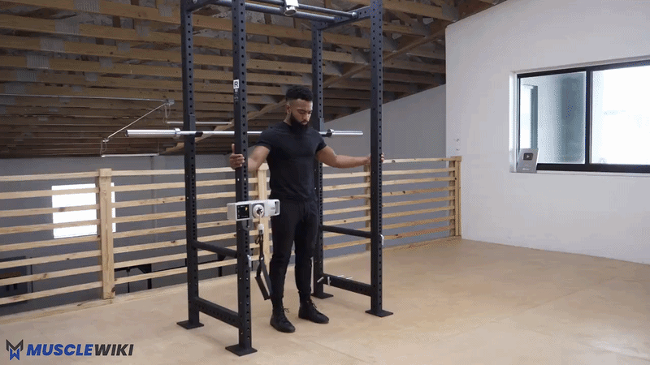
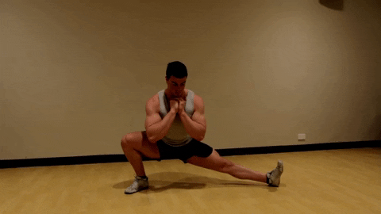
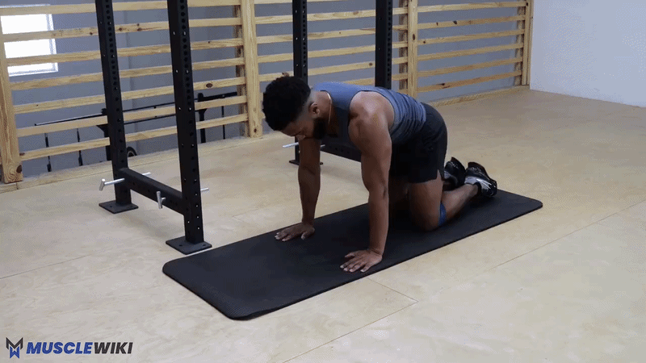

*Quads · Hamstrings · Glutes · Adductors · Calves*

**Days:** Wednesday (Legs 1) + Saturday (Legs 2) | **Duration:** ~24 min each | **Research:** [[leg-workout-research]]

Two short leg sessions per week. Legs 1 is **quad-focused**, Legs 2 is **posterior-chain + glutes**. **Single-leg calf raises** appear both days (anchor — your favourite, and calves respond well to frequency). Two swaps from the old plan based on your feedback: **Nordic curls → sliding leg curls** (no more wedging your ankles under the treadmill) and **single-leg RDL → B-stance RDL** (kills the balancing problem so you actually feel the muscle).

> [!warning] Right inner-groin
> Built as normal for now. If the right adductor/groin flares: on **Bulgarian split squats** do both legs (bilateral squats) with more reps instead, and **reduce range or skip Cossack squats**. Don't push into sharp pain. Revisit after the physio visit and we'll adjust.

> [!info] Evidence-based rest
> - **90s** — Bulgarian split squats, B-stance RDL
> - **60s** — standard
> - **45s** — calves, glute-med finishers

---

## Legs 1 — Quad Focus

### 1. Bulgarian Split Squats — 3×10-12 per side

> [!summary] Quads + Glutes (unilateral compound)
> **Feel:** Front-leg quad and glute burning; stretch in the rear hip flexor.

**How to:**
- Rear foot on a chair/couch (laces down), front foot ~60 cm ahead
- Lower until the front thigh is ~parallel, drive through the front heel, torso upright
- Most of the weight on the front leg; if the rear knee complains, move the front foot further forward

**Groin note:** if the inner-thigh area flares, swap to **bilateral squats** (goblet or bodyweight) for higher reps until it settles.


---

### 2. Sissy Squats — 3×8-10 *(you like these — kept)*

> [!summary] Quads — Isolation (stretch-focused)
> **Feel:** Intense stretch/burn in the front of the thigh, especially above the knee.

**How to:**
- Hold the TS900/doorframe for balance, knees travel forward as you lean back, heels can lift
- Lower until you feel a deep quad stretch, push back up through the quads

**Why it works for you:** it's the bodyweight "leg extension" — loads the rectus femoris in the stretched position. 6–10 hard reps is plenty.



---

### 3. Sliding Leg Curls — 3×8-12 *(NEW — replaces Nordic curls)*

> [!summary] Hamstrings — Knee Flexion
> **Feel:** Back of the thighs loading hard, especially as the legs extend out.

**How to:**
- Lie on your back, heels on towels / sliders / socks on a smooth floor
- Lift hips into a bridge and hold them up the whole set
- Slide both heels out away from you (legs straighten), then **curl them back** under you — that's one rep
- Keep hips up; the slower you slide out, the harder it is

**Why this replaced Nordics:** it trains the same eccentric knee-flexion pattern Nordics do — the actual hamstring-strength job — but needs **no ankle anchor**, so no more wedging under the treadmill or padding your shins. Difficulty self-regulates with tempo. Progress toward single-leg slides. (Banded lying leg curls are a fine backup if your floor isn't slippery.)


---

### 4. Single-Leg Calf Raises (off a step) — 3×12-15 *(anchor — you like these)*

> [!summary] Calves — Gastrocnemius
> **Feel:** Calf burning; full stretch at the bottom, full squeeze at the top.

**How to:**
- One foot on the edge of a step, hold the TS900 for balance
- Lower the heel below the step (full stretch), push to full contraction
- 2s up, 2s down — no bouncing. The bottom stretch is where the growth is.


---

## Legs 2 — Posterior Chain + Glutes

### 1. B-stance Romanian Deadlift — 3×10-12 per side *(NEW — replaces single-leg RDL)*

> [!summary] Hamstrings + Glutes — Hip Hinge
> **Feel:** Deep stretch + drive through the working glute/hamstring. Minimal balancing.

**How to:**
- Stagger your stance: working leg flat, **other foot back on its toes as a kickstand** (~60–80% of the weight on the front leg)
- Hinge at the hips — push the butt back, slight knee bend, lower the torso toward parallel
- Squeeze the glute to stand; don't round the lower back
- Hold a dumbbell (or one in each hand) for load

**Why this replaced single-leg RDL:** the kickstand removes almost all the balance demand, so the hamstrings/glutes become the limiter instead of your wobble — which fixes the "I only feel the stretch, not the muscle, and 3 reps takes forever" problem. You can also actually load it.


---

### 2. Hip Thrust / Glute Bridge — 3×12-15 *(NEW)*

> [!summary] Glutes — Hip Extension
> **Feel:** Glutes contracting hard at the top.

**How to:**
- **Hip thrust:** upper back on the couch/bench, feet flat, drive hips up until torso is parallel to the floor, squeeze 1s at the top, lower slowly. Hold a dumbbell on the hips for load.
- **Glute bridge** (floor version): same drive, shoulders on the floor — easier setup.

**Why added:** direct glute work the old plan was light on — and the glute strength here is exactly what helps the anterior-pelvic-tilt side of your postural work (the dead bug handles the front, the glutes handle the back).


---

### 3. Cossack Squats — 2×8-10 per side

> [!summary] Adductors + Hip Mobility (frontal plane)
> **Feel:** Deep stretch in the inner thigh of the straight leg.

**How to:**
- Wide stance, shift to one side squatting deep on that leg, other leg straight with toes up
- Chest up, don't round forward, alternate sides

**Groin note:** this loads the adductors in a stretched position, so it's the most likely to aggravate the right groin. Reduce depth or skip it for now if it bites — come back to it once the physio has weighed in.



---

### 4. Single-Leg Calf Raises — 3×12-15 *(anchor)*

Same as Legs 1 — see above. Calves get trained both days (you like them and they respond to frequency).


> [!note] Optional finisher: glute med (1 set, done properly)
> Side-lying leg raises + fire hydrants, 1 focused set per side. You're right that rushing 2 sets at the end does nothing — one slow, controlled set beats two rushed ones. Skip if short on time.
>
>  

---

## Time Breakdown

**Legs 1**

| # | Exercise | Sets × Reps | Rest | Time |
|---|----------|-------------|------|------|
| 1 | Bulgarian split squats | 3×10-12/side | 90s | ~7 min |
| 2 | Sissy squats | 3×8-10 | 60s | ~4 min |
| 3 | Sliding leg curls | 3×8-12 | 60s | ~4.5 min |
| 4 | Single-leg calf raises | 3×12-15 | 45s | ~4 min |
| — | **Total** | | | **~20 min** |

**Legs 2**

| # | Exercise | Sets × Reps | Rest | Time |
|---|----------|-------------|------|------|
| 1 | B-stance RDL | 3×10-12/side | 90s | ~6.5 min |
| 2 | Hip thrust / glute bridge | 3×12-15 | 60s | ~4.5 min |
| 3 | Cossack squats | 2×8-10/side | 60s | ~4 min |
| 4 | Single-leg calf raises | 3×12-15 | 45s | ~4 min |
| — | **Total** (+ optional glute-med set) | | | **~19 min** |

---

## Progression Roadmap

| Exercise | Now | Next | Later |
|----------|-----|------|-------|
| Bulgarian split squats | Bodyweight | 2s pause at bottom | Weighted (backpack / dumbbells) |
| Sissy squats | Assisted (hold TS900) | Freestanding | Weighted (hold a dumbbell) |
| Sliding leg curls | Both legs | Slower eccentric / fewer assists | Single-leg slides |
| B-stance RDL | 3 kg dumbbells | Heavier dumbbells | Single-leg RDL again |
| Hip thrust | Bodyweight / 3 kg dumbbell | Heavier dumbbell on hips | Barbell-style (loaded) |
| Cossack squats | 2×8-10 (pain-free) | Deeper ROM | Weighted |
| Calf raises | Bodyweight, 2s tempo | 3s eccentric | Weighted (hold a dumbbell) |

---

## Quick Reference

```
Quads (compound)   → Bulgarian split squats → weighted
Quads (isolation)  → Sissy squats → freestanding → weighted
Hamstrings (curl)  → Sliding leg curls → single-leg
Hamstrings (hinge) → B-stance RDL → heavier / dumbbell
Glutes             → Hip thrust + B-stance RDL + Bulgarians
Adductors / mobility → Cossack squats (scale for groin)
Glute med          → Side-lying raises + fire hydrants (finisher)
Calves             → Single-leg calf raise (both days)
```

---

## Garmin Connect Setup

**Legs 1 (Home)**

| Step | Exercise | Target | Rest |
|------|----------|--------|------|
| Warm up | 5 min walk or bodyweight squats | Lap Button | — |
| Repeat ×3 | Bulgarian Split Squat | 10/side | 90s |
| Repeat ×3 | Sissy Squat (custom) | 8 | 60s |
| Repeat ×3 | Hamstring Curl (for sliding curl) | 10 | 60s |
| Repeat ×3 | Standing Calf Raise (single-leg) | 12/side | 45s |

**Legs 2 (Home)**

| Step | Exercise | Target | Rest |
|------|----------|--------|------|
| Warm up | 5 min walk or bodyweight squats | Lap Button | — |
| Repeat ×3 | Single Leg Romanian Deadlift (B-stance) | 10/side | 90s |
| Repeat ×3 | Hip Thrust / Glute Bridge | 12 | 60s |
| Repeat ×2 | Cossack Squat (custom) | 8/side | 60s |
| Repeat ×3 | Standing Calf Raise (single-leg) | 12/side | 45s |
