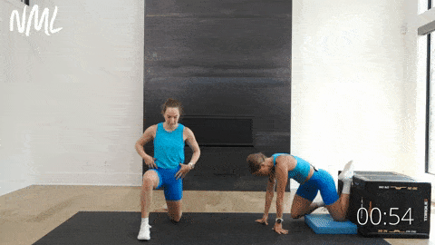

**Duration:** ~7–8 minutes | **When:** before every strength session (6×/week) | **Research:** [[postural-correction-research]]

Targets anterior pelvic tilt (lordosis), tight hips, tight hamstrings, and rounded shoulders. Two changes from your Week-3 feedback: the **90/90 → split into two easier stretches** (butterfly + figure-4, since you couldn't get into the 90/90 position), and **elevated puppy pose → hands-elevated child's pose** (the puppy was pinching your shoulders, not stretching them).

> [!tip] Short on time?
> Doing this 6 days a week, it's fine to alternate: keep the **primer + couch + hamstring + dead bug + wall angels** every day (~5 min), and do the **two hip-rotation stretches + child's pose** every other day. Frequency matters more than hitting all eight every single time.

---

## Primer (1 min)

**World's Greatest Stretch — 3 per side, flowing**

Warmup only — wakes up the joints. Lunge forward → plant inside hand → rotate top arm to the ceiling → push hips forward → shift hips back, straighten the front leg and fold over it (brief hamstring stretch) → return. Alternate sides each rep.


---

## Corrective Block (~6–7 min)

### 1. Couch Stretch — 40s per side

> [!summary] Anterior Pelvic Tilt
> **Muscles:** Psoas + rectus femoris · **Feel:** 6–7/10 stretch in the front of the hip

- Rear knee against the wall, shin vertical against the surface, front foot planted (~90°)
- Squeeze the back glute HARD, push hips forward, **tuck the tailbone under** (posterior tilt)

**Key cue:** if it feels easy, you're arching your back — the tuck is everything. (This is the one you said you can feel progressing — keep at it.)



---

### 2. Butterfly Stretch — 45s *(NEW — replaces 90/90, inner thigh)*

> [!summary] Tight Hips — Adductors (inner thigh)
> **Feel:** Stretch through the inner thighs/groin.

- Sit, soles of the feet together, let the knees fall open
- Sit tall (don't slump), gently press the knees down with the elbows, lean forward slightly from the hips for more

**Why it replaced the 90/90:** the 90/90 was meant to open the hips but you couldn't get into the position. Butterfly hits the inner-thigh half of that goal and is easy to get into and scale.


---

### 3. Supine Figure-4 — 30s per side *(NEW — replaces 90/90, outer hip)*

> [!summary] Tight Hips — Glutes / External Rotators (outer hip)
> **Feel:** Stretch deep in the outer hip/glute.

- Lie on your back, cross one ankle over the opposite knee (figure-4 shape)
- Reach through and pull the supporting thigh toward your chest
- Scale by how far you pull; switch sides

**This is the outer-hip half of the old 90/90.** Together, butterfly + figure-4 cover what the 90/90 did, with none of the awkward positioning.

> [!note] Optional — keep a little internal rotation
> The 90/90's back leg also trained *internal* rotation. To keep that: sit with knees bent and feet wide, and let one knee drop inward toward the floor for ~20s/side. Nice-to-have, not essential.


---

### 4. Supine Hamstring Stretch — 30s per side

> [!summary] Tight Hamstrings
> **Muscles:** Hamstrings · **Feel:** 6–7/10 stretch in the back of the thigh.

- On your back, one leg flat on the floor, loop a towel/belt around the other foot
- Gently pull the leg toward you, knee straight; keep the non-stretching leg flat (if it lifts, the hip flexors are compensating)

**Why supine:** lying down pins the spine flat and removes the back-rounding cheat. 30s is as effective as 60s for flexibility. (Essential and working for you — kept as-is.)


---

### 5. Dead Bug — 8 per side, alternating

> [!summary] Anterior Pelvic Tilt (anti-extension core)
> **Muscles:** Transverse abdominis + rectus abdominis · **Feel:** abs working to keep the back flat.

- Face-up, arms to the ceiling, knees at 90°, press the lower back FLAT into the floor
- Slowly extend the opposite arm + opposite leg, return, alternate

**Feeling it in the abs is correct — that's the point.** It's an anti-extension drill, so abs-dominant sensation = working. It helps lordosis but isn't a standalone fix: the glute side of the equation is handled by your **hip thrusts / Bulgarians on leg day**. The moment the lower back lifts off the floor, you've gone too far.


---

### 6. Hands-Elevated Child's Pose — 45s *(NEW — replaces elevated puppy pose)*

> [!summary] Lat + Shoulder-Flexion stretch
> **Feel:** Stretch through the armpits/sides of the upper back — NO pinching.

- Kneel and place your hands on a chair seat (~knee height), arms straight
- Hinge at the hips and let the chest sink down between the arms, head relaxed

**Why it replaced the puppy pose:** hands behind the head + sinking into deep overhead flexion was compressing your shoulder joint — that "pain" was a pinch, not a stretch. Hands on the seat (not behind the head) gives the same lat stretch without jamming the shoulder. **If anything pinches, raise the surface / reduce depth.**


---

### 7. Wall Angels — 10 reps, 2s up / 2s down

> [!summary] Rounded Shoulders
> **Muscles:** Lower/mid traps, serratus, rhomboids · **Feel:** hardest at the top, keeping everything on the wall.

- Back flat on the wall, feet ~15 cm out, arms in "cactus" (elbows 90°, touching the wall)
- Slide the arms overhead, keeping wrists, elbows AND lower back on the wall

**The wall is feedback:** if the elbows/wrists come off, work only the range you can honestly keep in contact. (A must — kept.)


> [!note] Optional: dead hang on the TS900 — 15–30s
> Now that you have the bar, a relaxed hang is the best progression for shoulder flexion + a gentle spinal decompression. Use it here or at the end of pull days.

---

## Time Breakdown

| # | Exercise | Time |
|---|----------|------|
| 0 | WGS primer | ~80s |
| 1 | Couch stretch (40s/side) | ~85s |
| 2 | Butterfly | ~50s |
| 3 | Supine figure-4 (30s/side) | ~65s |
| 4 | Supine hamstring stretch (30s/side) | ~65s |
| 5 | Dead bug | ~60s |
| 6 | Hands-elevated child's pose | ~50s |
| 7 | Wall angels | ~50s |
| — | **Total** | **~8 min** |

---

## Quick Reference

```
Anterior pelvic tilt  → Couch stretch + Dead bug (+ glutes on leg day)
Tight hips (inner)    → Butterfly stretch
Tight hips (outer)    → Supine figure-4
Tight hamstrings      → Supine hamstring stretch
Lat / shoulder flexion → Hands-elevated child's pose → dead hang (TS900)
Rounded shoulders     → Wall angels
Thoracic rotation     → WGS primer (maintenance)
```
