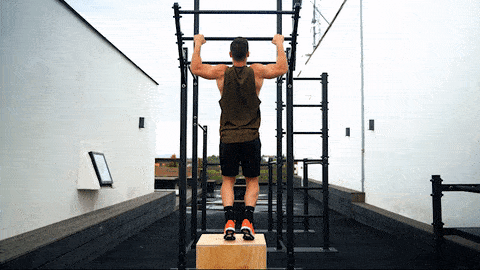
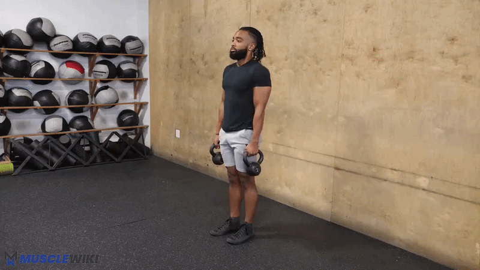

*Back · Rear Delts · Biceps · Traps*

**Days:** Tuesday (Pull 1) + Friday (Pull 2) | **Duration:** ~22 min each | **Research:** [[pull-workout-research]]

Two short pull sessions per week. The big upgrade: the **TS900 power tower** finally adds **vertical pulling** — the single biggest gap in the old plan — and gives you a proper, fixed bar for **inverted rows** instead of the treadmill handles (so you can vary grip and width now). You do a vertical pull on **both** days with **different grips**: overhand **pull-ups** on Pull 1 (lat/back emphasis) and underhand **chin-ups** on Pull 2 (biceps emphasis) — same bar, different targets. **Inverted rows** and a **biceps curl** also appear both days (anchors). Biceps are trained both days on purpose — you want the arms to grow.

> [!info] Evidence-based rest
> - **90s** — pull-ups / hardest row
> - **60s** — standard
> - **45s** — isolation finishers

> [!tip] Heavier dumbbells are the next purchase
> Curls use your 3 kg dumbbells for now. When 3×15 with a slow eccentric feels easy, that's the trigger for heavier (adjustable) dumbbells → see [[equipment-considerations]].

---

## Pull 1 — Vertical Pull + Rear Delts

### 1. Pull-ups, Overhand — 3× (band-assisted or negatives) *(NEW — back/lat emphasis)*

> [!summary] Lats + Mid-Back + Biceps
> **Feel:** Lats and upper back driving; full hang at the bottom.

**How to (pick your current level):**
- **Negatives:** jump/step to the top (chin over bar), lower as slowly as possible (aim 5s). 3×3-5.
- **Band-assisted:** loop a resistance band over the bar and under your knees/feet for assistance. 3×5-8.
- **Full pull-ups:** dead hang → pull chin over bar → control down. 3×AMRAP.

**Key cue:** start from a full dead hang each rep, pull the elbows down and back, no kipping. This **overhand** (pronated) grip biases the lats and upper back — the underhand **chin-up** (biceps) is your Pull 2 vertical pull.




---

### 2. Inverted Rows (TS900 bar) — 3×8-12 *(anchor)*

> [!summary] Lats + Mid-Back + Biceps (horizontal pull)
> **Feel:** Shoulder blades squeezing together.

**How to:**
- Set the bar at hip height, lie under it, grab it (now you can choose width + grip)
- Body straight from heels to head, pull chest to bar, squeeze shoulder blades, lower 2s
- **Angle controls difficulty:** more horizontal = harder; feet elevated (on a chair) = harder still

**Grip note:** alternate overhand (back emphasis) and underhand (lat/biceps) between sets — something the treadmill handles wouldn't let you do.


---

### 3. Band Pull-Aparts — 3×15-20

> [!summary] Rear Delts (isolation)
> **Feel:** Burn in the back of the shoulders; shoulder blades pinching.

**How to:**
- Band at shoulder height, arms straight in front
- Pull the band apart out to your sides, squeeze at full extension, slow return
- Keep arms STRAIGHT, and **don't let the shoulders shrug up** — that's the cue you've been working on; it's the right challenge


---

### 4. Concentration Curls — 3×12-15

> [!summary] Biceps — Short Head (peak contraction)
> **Feel:** Hard squeeze at the top; no cheating — the elbow is braced.

**How to:**
- Seated, elbow braced on inner thigh, curl with full ROM
- Squeeze 1s at the top, lower slowly (**4s eccentric**), full stretch at the bottom

**Good finisher for arm growth.** When 3×15 with a 4s eccentric feels easy, you need heavier than your 3 kg dumbbells → adjustable dumbbells.


> [!note] Optional: dead hang 20–30s
> Hang from the bar at the end — grip work + a nice shoulder/spine decompression. This is also the postural "shoulder flexion" progression now that you have a bar.

---

## Pull 2 — Chin-ups + Biceps

### 1. Chin-ups, Underhand — 3× (band-assisted or negatives) *(NEW — biceps emphasis)*

> [!summary] Biceps + Lats (vertical pull, supinated)
> **Feel:** Biceps loaded hard; full stretch at the dead hang.

**How to:**
- Underhand (supinated) grip ~shoulder-width, hang fully at the bottom
- Pull until your chin clears the bar, driving the elbows down, control the descent
- Same regressions as pull-ups — negatives (5s lower) or band-assisted, building to full reps

**Why both grips:** chin-ups bias the **biceps** (and still hit the lats); the overhand pull-ups on Pull 1 bias the **lats/back**. Same bar, different targets — that's why one grip lives on each day. Chin-ups are usually the grip you'll land your first unassisted rep on.


---

### 2. Inverted Rows (TS900 bar) — 3×8-12 *(anchor)*

Same as Pull 1 — see above. Try the other grip from what you used on Pull 1, or elevate the feet for progression.


---

### 3. Prone Y-T-W Raises — 3×8 each position

> [!summary] Mid-Back + Lower Traps + Rear Delts
> **Feel:** Burning between and below the shoulder blades. Looks easy — isn't.

**How to:**
- Face-down on the floor, arms extended
- **Y:** raise arms at 45° overhead (thumbs up), hold 2s, lower
- **T:** raise straight out to the sides, hold 2s, lower
- **W:** elbows bent, pull into a W squeezing the blades, hold 2s, lower
- 8 of each = 1 set. Use the 1.5 kg load when you can.

**Why it's only here (once/week):** it's slow and you flagged it eats time. Once a week is plenty for this detail work — the rows cover the mid-back the rest of the week. Keep it SLOW; momentum kills it.


---

### 4. Incline Dumbbell Curls — 3×12-15

> [!summary] Biceps — Long Head (stretched position)
> **Feel:** Deep stretch at the bottom of each rep — the money range for biceps growth.

**How to:**
- Lean back against a couch/the TS900 backrest (~45–60° recline), arms hanging straight down
- Curl up, squeeze, lower slowly (3s), let the arms fully extend at the bottom
- Keep elbows behind the torso throughout

**Use a 3 kg dumbbell per hand.** This is the gold-standard long-head exercise — when 3×15 with a slow eccentric feels easy, it's the first place you'll want heavier (adjustable) dumbbells.


---

### Optional finisher: Band Shrugs — 2–3×15-20

> [!summary] Upper Traps (optional)
> **Feel:** Top of the shoulders burning; squeeze hard at the top.

**How to:**
- Stand on the band, hold the ends at your sides with little slack (your band is strong — that's fine)
- Shrug straight up toward your ears, hold 2s, lower slowly

**Now optional, since chin-ups were added.** Upper traps are often already tight/overactive in desk workers, and the rows + Y-T-W already hit them — include this only if you specifically want more trap work, otherwise skip to keep the session short.



---

## Time Breakdown

**Pull 1**

| # | Exercise | Sets × Reps | Rest | Time |
|---|----------|-------------|------|------|
| 1 | Pull-ups (assisted/negatives) | 3×3-8 | 90s | ~5.5 min |
| 2 | Inverted rows | 3×8-12 | 90s | ~5 min |
| 3 | Band pull-aparts | 3×15-20 | 45s | ~3.5 min |
| 4 | Concentration curls | 3×12-15 | 45s | ~3.5 min |
| — | **Total** (+ optional dead hang) | | | **~18 min** |

**Pull 2**

| # | Exercise | Sets × Reps | Rest | Time |
|---|----------|-------------|------|------|
| 1 | Chin-ups (assisted/negatives) | 3×3-8 | 90s | ~5.5 min |
| 2 | Inverted rows | 3×8-12 | 90s | ~5 min |
| 3 | Prone Y-T-W | 3×8 each | 60s | ~5 min |
| 4 | Incline dumbbell curls | 3×12-15 | 60s | ~4 min |
| + | Band shrugs (optional) | 2–3×15-20 | 45s | +2-3 min |
| — | **Total** | | | **~20 min** |

---

## Progression Roadmap

| Exercise | Now | Next | Later |
|----------|-----|------|-------|
| Pull-ups (overhand) | Negatives / band-assisted | Full pull-ups 3×3-5 | Weighted (backpack/vest) |
| Chin-ups (underhand) | Negatives / band-assisted | Full chin-ups 3×3-5 | Weighted |
| Inverted rows | Bar at hip height | More horizontal / feet elevated | Weighted, or one-arm progressions |
| Band pull-aparts | 3×15-20 | 3s tempo each way | Face pulls / reverse flyes (with dumbbells) |
| Concentration curls | 3 kg dumbbell, 4s eccentric | Heavier dumbbell (5–8 kg) | Hammer curls |
| Prone Y-T-W | 1.5 kg | 2–3 kg | 5 kg |
| Incline curls | 3 kg dumbbell/hand | Heavier dumbbell/hand | Heavier; chin-ups for vertical biceps |
| Band shrugs | Band | Heavier dumbbell shrugs / farmer carries | — |

---

## Quick Reference

```
Lats (vertical)   → Pull-ups, overhand  (Pull 1) → weighted
Biceps (vertical) → Chin-ups, underhand (Pull 2) → weighted
Lats/back (horiz) → Inverted rows (both days)
Mid-back / l.traps → Prone Y-T-W
Rear delts        → Band pull-aparts → face pulls
Upper traps       → Band shrugs (optional)
Biceps (short)    → Concentration curls
Biceps (long)     → Incline curls
```

---

## Garmin Connect Setup

**Pull 1 (Home)**

| Step | Exercise | Target | Rest |
|------|----------|--------|------|
| Warm up | 2 min band pull-aparts (light) + arm swings | Lap Button | — |
| Repeat ×3 | Pull Up (or Assisted Pull Up) | 5 | 90s |
| Repeat ×3 | Inverted Row / Body Row | 10 | 90s |
| Repeat ×3 | Reverse Fly / Band Pull Apart | 15 | 45s |
| Repeat ×3 | Concentration Curl | 12 | 45s |

**Pull 2 (Home)**

| Step | Exercise | Target | Rest |
|------|----------|--------|------|
| Warm up | 2 min band pull-aparts (light) + arm swings | Lap Button | — |
| Repeat ×3 | Chin Up (or Assisted Chin Up) | 5 | 90s |
| Repeat ×3 | Inverted Row / Body Row | 10 | 90s |
| Repeat ×3 | Reverse Fly (for Y-T-W) | 8 each | 60s |
| Repeat ×3 | Incline Dumbbell Curl (custom) | 12 | 60s |
| Repeat ×2 | Shrug (optional) | 15 | 45s |
