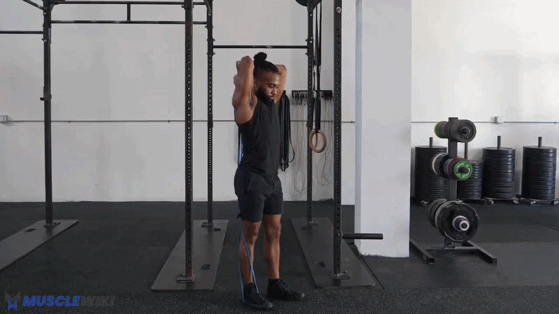

*Chest · Front Delts · Lateral Delts · Triceps*

**Days:** Monday (Push 1) + Thursday (Push 2) | **Duration:** ~20–22 min each | **Research:** [[push-workout-research]]

Two short push sessions per week. **Pike push-ups** and **lean-in lateral raises** appear both days (anchors — track these). Push 1 leans vertical-press + triceps long head; Push 2 leans chest-stretch + dips. Splitting the volume means you hit each pressing variation **fresh**, instead of grinding through 6 push movements in one session (the old problem where wide push-ups landed when you were already cooked).

> [!info] Evidence-based rest
> - **90s** — hardest pressing movement (pike, dips)
> - **60s** — everything else
> - **45s** — isolation finishers

---

## Push 1 — Shoulders + Triceps Long Head

### 1. Pike Push-ups — 3×8-10 *(anchor)*

> [!summary] Front Delts + Upper Chest + Triceps
> **Feel:** Shoulders burning. Hips stay high the whole time.

**How to:**
- Feet on floor, hips high (downward-dog / inverted-V)
- Hands shoulder-width, lower the top of your head toward the floor between your hands
- Push back up; the steeper the hips, the more shoulder-dominant

**Key cue:** If hips drop, it becomes a regular push-up. Keep them stacked high. A wider foot stance makes it easier; feet on a low step (Phase 2) makes it harder.


---

### 2. Push-ups (loaded) — 3×10-15, 3s eccentric

> [!summary] Chest (mid) + Front Delts + Triceps
> **Feel:** Chest and front shoulder working; controlled, not rushed.

**How to:**
- Shoulder-width hands, elbows ~45° to the torso (don't flare to 90°)
- Lower until chest nearly touches floor — **3 seconds down** — then press up with full lockout
- Protract the shoulders at the top (push the floor away — hits serratus)

**You can do 20 fresh, so add load, not reps:** the 3s eccentric is step one. When 3×15 slow reps feel easy, add a **loaded backpack** (5–10 kg of books/water). That's the cleanest way to keep progressing — chasing 30+ reps just trains endurance.


---

### 3. Lean-in Lateral Raises — 3×12-15 *(anchor)*

> [!summary] Lateral Delts (isolation)
> **Feel:** Burn on the outside of the shoulder from ~rep 10.

**How to (lean-in, per Jeff Nippard):**
- Hold a support (doorframe / TS900 upright) with one hand and **lean your torso away** from the working arm
- Working arm hangs slightly across the body at the bottom → this loads the side delt in the **stretched** position
- Raise the dumbbell out to just above shoulder height, slight elbow bend, control the descent
- Switch sides. Use the 3 kg dumbbells.

**Why lean-in:** leaning increases tension at the bottom (lengthened position) where the standard upright raise gives almost none. Good choice keeping these.


---

### 4. Overhead Triceps Extension (dumbbell) — 3×12-15

> [!summary] Triceps — Long Head (stretched position)
> **Feel:** Deep stretch in the back of the upper arm at the bottom, contraction overhead.

**How to:**
- Hold one 3 kg dumbbell with both hands behind your head, elbows pointing up
- Extend arms to straight overhead, then lower slowly — feel the stretch
- Keep elbows pointing forward/up, not flaring out

**Now that you're on dumbbells (not the band):** gravity loads the stretched position correctly — this is the better setup. When 3×15 feels easy, slow the eccentric to 4s before adding weight.



---

## Push 2 — Chest Stretch + Dips

### 1. Deficit Push-ups — 3×8-12, 1–2s pause at bottom

> [!summary] Chest (stretch-focused) + Front Delts
> **Feel:** Deep chest stretch at the bottom, below hand level.

**How to:**
- Hands on two low stacks of books / parallettes (~10 cm)
- Lower so your chest drops **below** your hands → loaded stretch
- Pause 1–2s at the bottom, then press up

**This replaced wide push-ups.** Wide push-ups were "hard" mostly from awkward leverage, not better chest work. Deficit push-ups load the chest in the lengthened position (where most growth happens) and you control the depth. Raise the stacks over time for more range.


---

### 2. Pike Push-ups — 3×8-10 *(anchor)*

Same as Push 1 — see above. Keeps shoulder frequency at 2×/week.


---

### 3. Lean-in Lateral Raises — 3×12-15 *(anchor)*

Same as Push 1 — see above. Side delts get **zero** from pressing, so they're trained both days.


---

### 4. Dips (on TS900) — 3×6-10

> [!summary] Chest (lower) + Triceps (compound) — NEW with the power tower
> **Feel:** Chest and triceps under a big stretch at the bottom; strong push to lock out.

**How to:**
- Grip the TS900 dip handles, support yourself with arms straight
- Lower until upper arms are ~parallel to the floor (or to a comfortable shoulder stretch)
- **Lean the torso forward** = more chest; stay upright = more triceps
- Press back up to lockout. Control the descent.

**Start conservative:** dips are demanding. Use a small range first and only go as deep as your shoulders comfortably allow; build range over weeks. 6 clean reps is a fine starting point. Optional finisher if you have gas left: **diamond push-ups, 1× to failure**.


---

## Time Breakdown

**Push 1**

| # | Exercise | Sets × Reps | Rest | Time |
|---|----------|-------------|------|------|
| 1 | Pike push-ups | 3×8-10 | 90s | ~5 min |
| 2 | Push-ups (loaded, 3s ecc) | 3×10-15 | 60s | ~5 min |
| 3 | Lean-in lateral raises | 3×12-15 | 60s | ~4.5 min |
| 4 | Overhead triceps ext | 3×12-15 | 60s | ~4.5 min |
| — | **Total** | | | **~19 min** |

**Push 2**

| # | Exercise | Sets × Reps | Rest | Time |
|---|----------|-------------|------|------|
| 1 | Deficit push-ups (paused) | 3×8-12 | 60s | ~5 min |
| 2 | Pike push-ups | 3×8-10 | 90s | ~5 min |
| 3 | Lean-in lateral raises | 3×12-15 | 60s | ~4.5 min |
| 4 | Dips | 3×6-10 | 90s | ~5.5 min |
| — | **Total** | | | **~20 min** |

---

## Progression Roadmap

| Exercise | Now | Next | Later |
|----------|-----|------|-------|
| Pike push-ups | Floor, 3×8-10 | Feet on a low step | Wall handstand push-ups (partial) |
| Push-ups (loaded) | 3s eccentric | Loaded backpack 5–10 kg | Deficit + backpack / archer push-ups |
| Deficit push-ups | Books ~10 cm, paused | Deeper deficit / between two chairs | Weighted (backpack) |
| Lean-in lateral raises | 3 kg | Heavier dumbbells (5–8 kg) | — |
| Overhead triceps ext | 3 kg, 4s eccentric | Heavier dumbbell | — |
| Dips | Partial ROM, 3×6-10 | Full ROM, 3×10 | Weighted (backpack / vest) |

---

## Quick Reference

```
Chest (mid)      → Push-ups (loaded) → backpack
Chest (stretch)  → Deficit push-ups → Dips (forward lean)
Shoulders        → Pike push-ups → feet elevated → handstand
Lateral delts    → Lean-in lateral raises (both days — don't skip)
Triceps (long)   → Overhead extension
Triceps (compound) → Dips (upright) (+ diamond push-up finisher)
```

---

## Garmin Connect Setup

**Push 1 (Home)**

| Step | Exercise | Target | Rest |
|------|----------|--------|------|
| Warm up | 2 min arm circles + 10 easy push-ups | Lap Button | — |
| Repeat ×3 | Pike Push Up (custom) | 10 | 90s |
| Repeat ×3 | Push Up (3s eccentric) | 12 | 60s |
| Repeat ×3 | Lateral Raise | 12 | 60s |
| Repeat ×3 | Overhead Triceps Extension | 12 | 60s |

**Push 2 (Home)**

| Step | Exercise | Target | Rest |
|------|----------|--------|------|
| Warm up | 2 min arm circles + 10 easy push-ups | Lap Button | — |
| Repeat ×3 | Deficit Push Up (custom) | 10 | 60s |
| Repeat ×3 | Pike Push Up (custom) | 10 | 90s |
| Repeat ×3 | Lateral Raise | 12 | 60s |
| Repeat ×3 | Dip | 8 | 90s |
